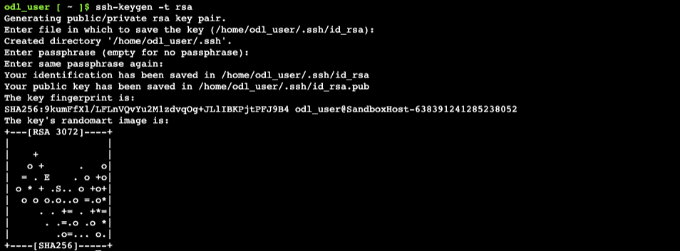
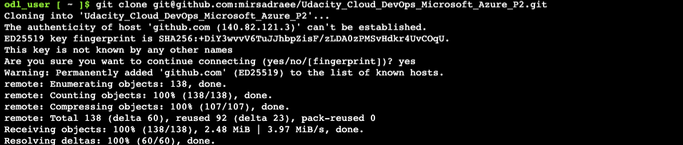
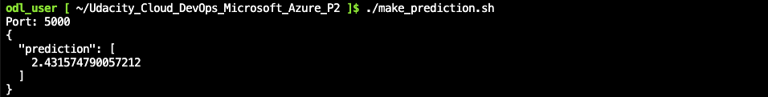
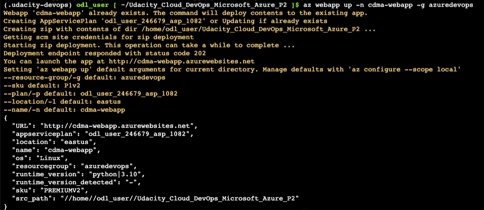

# Overview
## Cloud DevOps using Microsoft Azure - Second Project
In this project:
- A GitHub repository is built from scratch and a scaffolding is created that will assist in performing both `Continuous Integration` and `Continuous Delivery`. 
- The `GitHub Actions` is used along with a `Makefile`, `requirements.txt` and application code to perform an `initial lint`, `test`, and `install cycle`. 
- Finally, the project is integrated with Azure Pipelines to enable `Continuous Delivery` to `Azure App Service`.

A pre-trained, sklearn model that has been trained to predict housing prices in Boston according to several features, such as *average rooms in a home* and data about *highway access*, *teacher-to-pupil ratios*, and so on is provided by `Udacity`. Further Information about the data, which was initially taken from Kaggle, can be found on the [data source site](https://www.kaggle.com/c/boston-housing). 

This project will operationalize a Python flask app—in a provided file, `app.py` that serves out predictions (inference) about housing prices through API calls. This project could be extended to any pre-trained machine learning model, such as those for image recognition and data labeling.

The steps for preparation of the pipeline is given in figure below:


The main 4 steps for Agile project management are namely:
- Source Control
- Continuous Integration (CI)
- Continuous Delivery (CD)
- Platform as a Service (PaaS)


## Project Plan
For project planning and management two usefull tools are `Trello` and `Excel` for showing the progress and status of project progress.
* The [Trello](https://trello.com/b/F1yeX3wd/building-a-ci-cd-pipeline) board for the project to keep track of tasks and their status.
* The [Spreadsheet](project-management.xlsx) that includes the original and final project plan.
* See here for a YouTube video demonstrating the project.

## Instructions
### CI: Set Up GitHub Repo & Azure Cloud Shell


An initial project structure is the setup of Azure Cloud Shell environment. A git repository is created and an Azure Cloud Shell environment is launched and GitHub Repository communication is integrated.

For connecting to GitHub repository, it is needed to generate a ssh-key:

`ssh-keygen -t rsa`



The ssh-key can be retreived over the shell through:

`cat ~/.ssh/id_rsa.pub`

Now the key hgas to be added to the GitHub as new ssh-key.

To clone the GitHub repository, following command has to be used in the Azure Cloud Shell:

`git clone git@github.com:mirsadraee/Udacity_Cloud_DevOps_Microsoft_Azure_P2.git`



A virtual environment has to be setup:

`make setup`

Activate the virtual environment:

`source ~/.udacity-devops/bin/activate`

Install all dependencies and  running lint in th evirtual environment:

`make all`


Now, we can run the application in the trerminal using:

`python app.py`

As the application is now running, we have to open a new terminal and test the application, consider changeing the path to the correct one using:

`cd Udacity_Cloud_DevOps_Microsoft_Azure_P2`

`./make_prediction.sh`

The output of the run is:



The application can be  stopped using `Ctrl+C` in the first terminal.

* Successful deploy of the project in Azure Pipelines.  [Note the official documentation should be referred to and double checked as you setup CI/CD](https://docs.microsoft.com/en-us/azure/devops/pipelines/ecosystems/python-webapp?view=azure-devops).
Running Azure App Service from Azure Pipelines automatic deployment

``` 
az webapp config set -g <your-resource-group> -n <your-appservice> --startup-file <your-startup-file-or-command>
```
so the command has to be updated based on the resource group and app name, so:
```
az webapp up -n ndadma-webapp -g azuredevops
```
Next, create and configure the pipeline in Azure DevOps. More information on this process can be found here. The basic steps to set up the pipeline are:

Go to https://dev.azure.com and sign in.
Create a new private project.
Under Project Settings create a new service connection to Azure Resource Manager, scoped to your subscription and resource group.
Create a new pipeline (python to linux web app on azure)linked to your GitHub repo.



Verify the deployed application works by browsing to the deployed url
Go to `-X POST https://<yourappname>.azurewebsites.net:$PORT/predic` in the `make_predict_azure_app.sh`, a successful prediction will look like this:


### CI: Configure GitHub Actions & Create a WebApp Manually
Configuring a SaaS build server like GitHub Actions is an essential step for any software project that wants to apply DevOps best practices. This completes the final section of Continous Integration and enables us to then move on to the later step of Continuous Delivery once this is complete.

This diagram shows how code can be tested automatically by enabling GitHub Actions. The push change to GitHub triggers the GitHub Actions container, which in turn runs a series of commands.


#### Create an Agent Pool


#### Configure the Agent (VM) - Install Docker


#### Configure the Agent (VM) - Install Agent Services


### CI: Continuous Delivery on Azure
Next, create and configure the pipeline in Azure DevOps. More information on this process can be found here. The basic steps to set up the pipeline are:

- A GitHub repo having a sample application code.
- Logged into the [https://portal.azure.com/](https://portal.azure.com/)
- Created a DevOps org and a project at [https://dev.azure.com/](https://dev.azure.com/)
- Created a Service connection in the `DevOps` project, scoped to the subscription and resource group.
- Your DevOps project should have a `self-hosted` Agent.

 -->

- Creating a new pipelinelinked to the GitHub repo:
The pipeline `azure-pipeline.yaml` for build:


```yaml
# Python to Linux Web App on Azure
# Build your Python project and deploy it to Azure as a Linux Web App.
# Change python version to one thats appropriate for your application.
# https://docs.microsoft.com/azure/devops/pipelines/languages/python

trigger:
  - main
  
  variables:
    # Azure Resource Manager connection created during pipeline creation
    azureServiceConnectionId: '1fa1b2b1-ea24-43ce-8dd8-af8735cb96a5'
  
    # Web app name
    webAppName: 'udacity-azure-project2'
  
    # Agent VM image name
    vmImageName: 'ubuntu-latest'
  
    # Environment name
    environmentName: 'udacity-azure-project2'
  
    # Project root folder. Point to the folder containing manage.py file.
    projectRoot: $(System.DefaultWorkingDirectory)
  
    # Python version: 3.7
    pythonVersion: '3.7'
  
  stages:
  - stage: Build
    displayName: Build stage
    jobs:
    - job: BuildJob
      pool: myAgentPool
      steps:
      - task: UsePythonVersion@0
        inputs:
          versionSpec: '$(pythonVersion)'
        displayName: 'Use Python $(pythonVersion)'
  
      - script: |
          python -m venv antenv
          source antenv/bin/activate
          python -m pip install --upgrade pip
          pip install setup
          pip install -r requirements.txt
        workingDirectory: $(projectRoot)
        displayName: "Install requirements"
  
      - task: ArchiveFiles@2
        displayName: 'Archive files'
        inputs:
          rootFolderOrFile: '$(projectRoot)'
          includeRootFolder: false
          archiveType: zip
          archiveFile: $(Build.ArtifactStagingDirectory)/$(Build.BuildId).zip
          replaceExistingArchive: true
  
      - upload: $(Build.ArtifactStagingDirectory)/$(Build.BuildId).zip
        displayName: 'Upload package'
        artifact: drop
```
The pipeline `azure-pipeline.yaml` for build and deploy:
```yaml
# Python to Linux Web App on Azure
# Build your Python project and deploy it to Azure as a Linux Web App.
# Change python version to one thats appropriate for your application.
# https://docs.microsoft.com/azure/devops/pipelines/languages/python

trigger:
  - main
  
  variables:
    # Azure Resource Manager connection created during pipeline creation
    azureServiceConnectionId: '1fa1b2b1-ea24-43ce-8dd8-af8735cb96a5'
  
    # Web app name
    webAppName: 'udacity-azure-project2'
  
    # Agent VM image name
    vmImageName: 'ubuntu-latest'
  
    # Environment name
    environmentName: 'udacity-azure-project2'
  
    # Project root folder. Point to the folder containing manage.py file.
    projectRoot: $(System.DefaultWorkingDirectory)
  
    # Python version: 3.7
    pythonVersion: '3.7'
  
  stages:
  - stage: Build
    displayName: Build stage
    jobs:
    - job: BuildJob
      pool: myAgentPool
      steps:
      - task: UsePythonVersion@0
        inputs:
          versionSpec: '$(pythonVersion)'
        displayName: 'Use Python $(pythonVersion)'
  
      - script: |
          python -m venv antenv
          source antenv/bin/activate
          python -m pip install --upgrade pip
          pip install setup
          pip install -r requirements.txt
        workingDirectory: $(projectRoot)
        displayName: "Install requirements"
  
      - task: ArchiveFiles@2
        displayName: 'Archive files'
        inputs:
          rootFolderOrFile: '$(projectRoot)'
          includeRootFolder: false
          archiveType: zip
          archiveFile: $(Build.ArtifactStagingDirectory)/$(Build.BuildId).zip
          replaceExistingArchive: true
  
      - upload: $(Build.ArtifactStagingDirectory)/$(Build.BuildId).zip
        displayName: 'Upload package'
        artifact: drop
  
  - stage: Deploy
    displayName: 'Deploy Web App'
    dependsOn: Build
    condition: succeeded()
    jobs:
    - deployment: DeploymentJob
      pool: myAgentPool
      environment: $(environmentName)
      strategy:
        runOnce:
          deploy:
            steps:
  
            - task: UsePythonVersion@0
              inputs:
                versionSpec: '$(pythonVersion)'
              displayName: 'Use Python version'
  
            - task: AzureWebApp@1
              displayName: 'Deploy Azure Web App : udacity-azure-project2'
              inputs:
                azureSubscription: $(azureServiceConnectionId)
                appName: $(webAppName)
                package: $(Pipeline.Workspace)/drop/$(Build.BuildId).zip
```


### Making predictions
To make a prediction, you have to open a separate tab or terminal window. In this new window, navigate to the main project directory (some computers will do this automatically) and call .`/make_prediction.sh` if testing locally, or modify `make_predict_azure_app.sh`.

This shell script is responsible for sending some input data to your application via the appropriate port. Each numerical value in here represents some feature that is important for determining the price of a house in Boston. The source code is responsible for passing that data through a trained, machine learning model, and giving back a predicted value for the house price.

In the prediction window, you should see the value of the prediction, and in your main window, where it indicates that your application is running, you should see some log statements print out. You’ll see that it prints out the input payload at multiple steps: when it is JSON and when it’s been converted to a DataFrame and about to be scaled.

#### Logs
You can inspect the logs from your running application here:

`https://<app-name>.scm.azurewebsites.net/api/logs/docker`

Or stream them:

`az webapp log tail`

#### Load test an application using Locust
- The Readme should have a screenshot of the application running against a load test with locust.

  Install locust and then run locust:

  `pip install locust`

  `locust`


- There should be a `locustfile.py` file in the repo that is a working example of the load test script specified in the instructions.
- A running Locust for test against the deployed application is shown below:


#### Azure CLI to Deploy and Manage
- Use the Azure CLI to deploy and manage an application.
- The GitHub repo should contain Azure CLI commands in a Bash script called, `commands.sh`, including `az webapp up -n <your-appservice>`
- You must show the deployed URL in the command.
Open a browser and go to http://localhost:8089. Enter the total number of users to simulate, spawn rate, set the host to https://udacity-app.azurewebsites.net/, and click Start Swarming:


Load Test:
## Enhancements

<TODO: A short description of how to improve the project in the future>

## Demo 

<TODO: Add link Screencast on YouTube>